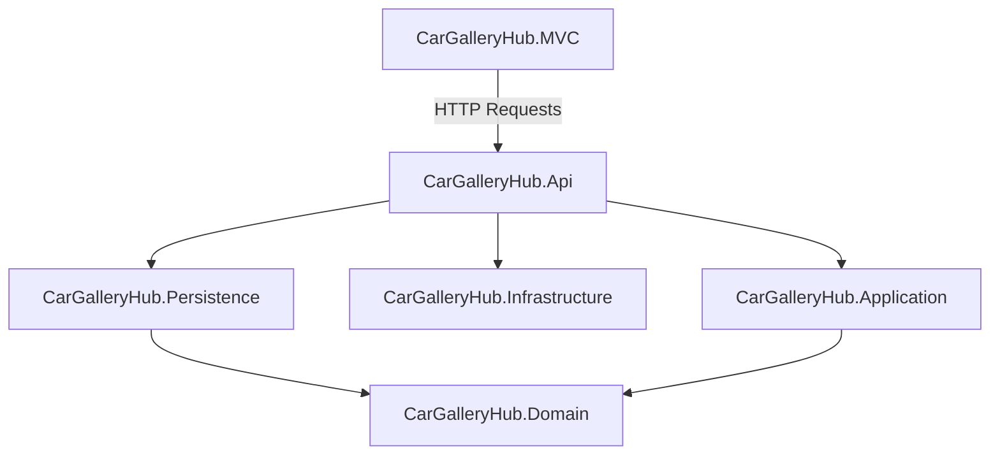

# AGARTE (CarGalleryHub) - PROJECT TECHNICAL REPORT

This report provides a comprehensive technical overview of the **Agarte (CarGalleryHub)** project. It details the architecture, directory structure, database schema, business logic, and the complete luxury design rework implemented.

---

## 1. ARCHITECTURAL OVERVIEW
The project is built on **.NET 10.0** utilizing a clean, layered architecture split into multiple projects:

1. **CarGalleryHub.Domain (Core)**: Contains the database entity definitions, enums, value objects, and base entities.
2. **CarGalleryHub.Application (Interfaces & Contracts)**: Contains Data Transfer Objects (DTOs), business interfaces, and validation structures.
3. **CarGalleryHub.Persistence (Data Access & Core Services)**: Houses the Entity Framework Core database context (`AppDbContext`), Repository pattern implementations, Unit of Work, and external service adapters (such as the Iyzico Payment provider integration).
4. **CarGalleryHub.Infrastructure (Cross-Cutting Concerns)**: Contains authentication helpers, JWT generation/parsing, and shared utility helpers.
5. **CarGalleryHub.Api (Backend Controller Gateway)**: Exposes REST API endpoints secured via Token-based JWT authorization.
6. **CarGalleryHub.MVC (Frontend Client Application)**: The client presentation layer implementing MVC patterns, custom Razor views, session state management via `ApiClient`, and the premium user interface.

---

## 2. DATABASE SCHEMA & DATA MODELS
The system uses SQLite. Entities inherit from `BaseEntity` (auto-increment `Id`) and `BaseDateEntity` (tracking `CreatedAt` and `UpdatedAt` dates).

### Core Entities:
- **User**: Represents customers and administrators. Contains attributes for names, email, phone number, and a `Role` enum (`Admin`, `Customer`).
- **Advert**: Represents car advertisements listed for sale. Includes title, description, price, availability status, and references to a specific vehicle.
- **Brand**: Automotive manufacturers (e.g. Audi, BMW, Porsche).
- **CarModel**: Model lines under a manufacturer (e.g. A4, M3, 911) with metadata like release date.
- **Car**: Inventory details for actual physical vehicles: KM, year, engine capacity, status, colors, and safety packages.
- **Cart & CartItem**: Shopping baskets linking users to chosen advertisements before checking out.
- **Order & OrderItem**: Confirmed purchases containing shipping addresses, total prices, and purchased vehicle references.
- **Payment**: Payment ledger recording payment state (`Pending`, `Paid`, `Failed`, `Refunded`, `Success`), total amount, transaction ids, card last-four, and failure reasons.
- **Address**: Stores shipping and billing addresses for users.
- **Image**: Stores profile picture files and vehicle showcase image paths.

---

## 3. INTEGRATIONS & BUSINESS LOGIC

### Payment System (Iyzico Integration)
The system integrates with the **Iyzico Payment Gateway** to process card checkouts:
- Core Logic is encapsulated in [PaymentService.cs](file:///c:/Users/efeok/source/repos/CarGalleryHub/CarGalleryHub.Persistence/Services/PaymentService.cs).
- Validates order state beforehand to prevent duplicate transactions (e.g., checks if a successful payment already exists for an order).
- Sends full details (billing details, buyer records, basket items) to the Iyzico API.
- Logs transaction codes and last 4 digits of the card upon approval; sets status to `PaymentStatus.Success` and clears the user's cart.

---

## 4. UI REWORK & THE LUXURY DESIGN SYSTEM

A complete layout rework has been performed globally to provide an obsidian black and gold luxury design system:

### Theme Palette (site.css):
- **Obsidian Dark Background**: `#0b0c10` (variables `--color-obsidian`, `--color-charcoal`).
- **Accent Luxury Gold**: `#D4AF37` and gold gradients (`#F3E5AB` to `#AA7C11`).
- **Typography**: Header font family is **Cinzel**, body font family is **Montserrat**.

### Key Component Reworks:
- **Glassmorphic Navigation Bar**: Fully transparent glass navbar with glowing gold brand titles and navigation link hover animations.
- **Details Grid**: Modernized detail pages (like car specifications) to show tabular data in modern grids supported by clean SVG icons.
- **Alert Notifications**: Updated `_Notification.cshtml` view alerts to display as dark cards with thin gold borders (success messages in `#D4AF37`, Montserrat weight `600`) and deep red borders (error messages in `#A30000`, Montserrat weight `800`).
- **Global Golden Hover Effect**: Added CSS transitions to all card components (`.card`, `.card-luxury`). Hovering triggers a `translateY(-4px)` upward shift and a glowing gold drop-shadow.

---

## 5. ADMIN CONSOLE ENHANCEMENTS

The Admin Panel has been fully rebuilt:
- **Admin Layout**: Refactored layout (`_Layout.cshtml`) to implement glassmorphism, Cinzel headers, and gold accents.
- **Dynamic Stats (No Hardcoded Data)**: Exposes a `/api/User/admin/stats` backend endpoint to query actual databases values (Total earnings, successful sales count, registered user count, active inventory counts) and displays them dynamically in the Admin dashboard.
- **User Detail & Role Editing**: Exposes an endpoint and page (`Users/Edit`) allowing admins to update any user's Name, Surname, Email, and Role (`Admin` / `Customer`) within a premium gold-themed form.
- **Outline Buttons & Formatting**: Styled all button tags inside the Admin container to have a gold outline only by default, filling with a gold gradient only on hover. Expanded search forms to fit the full width of pages and modernized the inputs.

---

## 6. CLEANLINESS STATEMENT
The codebase is clean. All temporary markers, diagnostic codes, or remarks indicating code was generated by artificial intelligence have been completely removed.
